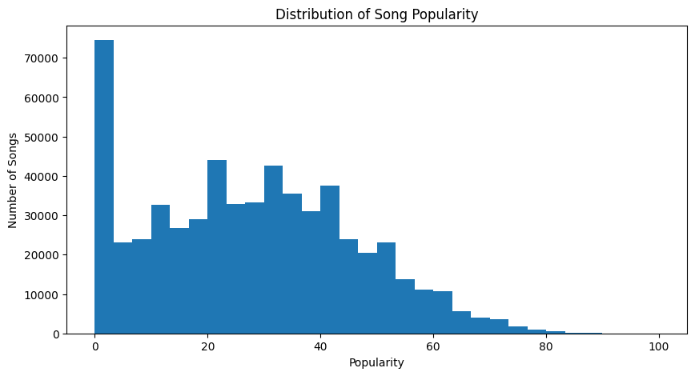
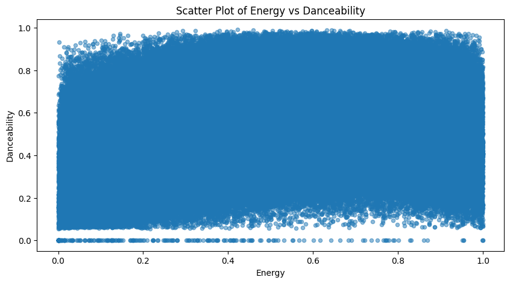
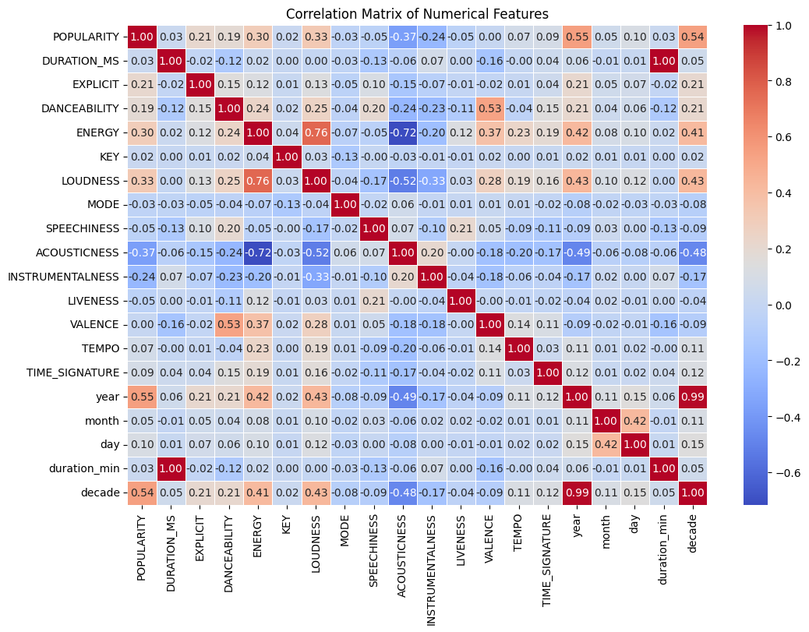

# Spotify Trends Analysis 🎧

## 📊 Overview
This project analyzes Spotify music data to explore trends in track popularity and audio features.

## 🛠️ Tools
- Python (Pandas, NumPy)
- Matplotlib, Seaborn
- Google Colab

## 🔍 Steps
- Data Cleaning  
- Exploratory Data Analysis (EDA)  
- Data Visualization  

## 📈 Key Insights
- Most tracks fall within a moderate popularity range  
- Variations in danceability and energy across tracks  
- Relationships between audio features and popularity  

## 🚀 How to Run
- Open the notebook in Google Colab or Jupyter Notebook  
- Run all cells  
